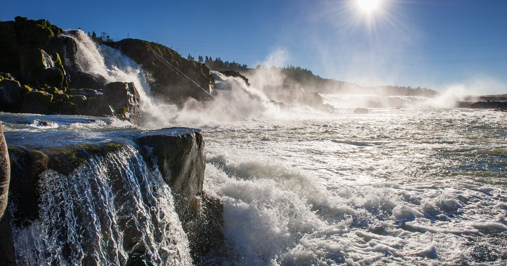
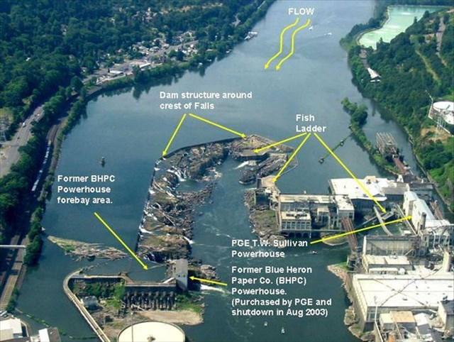

# Overview 
This report visualizes data collected from Columbia Barin Research's Data Access in Real Time (DART). The data utilizes is a collection of fish passages through the Willamette Falls Fish Ladder organized by species from 2001-2010. A time series is created for Coho, Jack Coho, and Steelhead salmon to understand how their population runs have changed over time. A season plot is shown to demonstrate their differing run times. Lastly, annual counts are shown to demonstrate how population abundance  shifted over a ten year period. 




{width=100%}


**Data Citation:** DART Adult Passage Graphics & Text | Columbia Basin Research. (2012). http://www.cbr.washington.edu/dart/query/adult_graph_text
# Findings {.tabset .tabset-fade}

#### Data Preparation
```{r setup, include=TRUE, warning=FALSE, message=FALSE}
knitr::opts_chunk$set(echo = TRUE, warning = FALSE, message = FALSE)
library(tidyverse)
library(here)
library(lubridate)
library(janitor)
library(tsibble)
library(feasts)
library(slider)
library(patchwork)
library(prettydoc)
library(paletteer)
```

```{r}
### Data Wrangling 
willamette_fish <- read_csv(here('data', 'willamette_fish_passage.csv')) %>% 
  clean_names() 
  
fish_sub <- willamette_fish %>% 
  mutate(date = mdy(date)) %>%
  as_tsibble(key = NULL, index = date)  %>% 
  select(date, steelhead, coho, jack_coho, ) %>% 
  replace_na(list(steelhead = 0, coho = 0, jack_coho = 0))
  
fish_ts <- fish_sub %>% 
  pivot_longer(cols = c(steelhead, coho, jack_coho),
               names_to = 'species',
               values_to = 'count') %>%
  mutate(species = case_when(
    species == 'coho' ~ 'Coho',
    species == 'jack_coho' ~ 'Jack Coho',
    species == 'steelhead' ~ 'Steelhead'))
```


## Fish Passage Time Series
```{r fig.align='center'}
#Visualization 
coho_ts <- ggplot(data = fish_sub, aes(x = date, y = coho)) +
  geom_line(color = 'darkslategrey') +
  theme_classic() +
  labs(y = "Coho",
       x= "Date")
jack_coho_ts <-ggplot(data = fish_sub, aes(x = date, y = jack_coho)) +
  geom_line(color = 'lightgoldenrod4') +
  theme_classic() +
  labs(y = "Jack Coho",
       x= "Date")
steelhead_ts <- ggplot(data = fish_sub, aes(x = date, y = steelhead)) +
  geom_line(color = 'deeppink4') +
  theme_classic() +
  labs(y = "Steelhead",
       x= "Date")

coho_ts/jack_coho_ts/steelhead_ts

```
**Figure 1.** Original time series of Coho, Jack Coho and Steelhead salmon through the Willamette Fish Ladder from 2001 to 2010. 

### Conclusions:  

- Passage is relatively consistent across this 10 year period for all species.
- Jack Coho passages appear to be declining while Coho and Steelhead passages are increasing. 
- 2008 Appears to be a significant year for this shift between Jack Coho and Coho.
- Average abundance of Steelhead doubles that of Jack Coho, while Steelhead abundances became half as large as Coho in between 2008 and 2010.

## Seasonplots
```{r fig.align='center'}
fish_per_month <- fish_ts %>% 
  index_by(month = ~yearmonth(.)) %>% 
  group_by(species) %>% 
  summarize(monthly_sum = sum(count, na.rm = TRUE)) %>% 
  mutate(year = year(month))

fish_per_month %>% 
gg_season(y = monthly_sum,
          pal = paletteer_c(palette = "ggthemes::Orange-Blue Diverging", n = 10)) +
  theme_light() +
  labs(x = "Month",
       y = "Fish Passages",
       color="Year") 

```
**Figure 2:** Seasonplot of Coho, Jack Coho and Steelhead. There is an obvious seasonality here, exhibiting niche tradeoffs. 


### Conclusions: 
- Coho and Jack Coho compete for resources as their runs match up between August and November
- Steelhead have a longer but opposite run season ranging from January to August
- There is a key niche tradeoff here as species have shifted their spawning seasons to maximize their potential of reaching spawning grounds up river with minimal competition. 

## Annual Counts By Species: 

```{r}
fish_annual <- fish_ts %>% 
  index_by(year = ~year(.)) %>% 
  group_by(species) %>% 
  summarize(annual_counts = sum(count))

steelhead_annual <- fish_annual %>%
  filter(species %in% c("Steelhead"))

coho_annual <- fish_annual %>%
  filter(species %in% c("Coho"))

jack_coho <- fish_annual %>%
  filter(species %in% c("Jack Coho"))

steelhead <- ggplot(data = steelhead_annual, aes(x = year, y = annual_counts)) +
  geom_line(color = 'deeppink4') +
  theme_light() +
  labs(x = "Year",
       y = "Annual Counts",
       title = "Steelhead") +
  theme(axis.text.x = element_text(angle=45, hjust=1)) +
    scale_x_continuous(n.breaks = 8)

coho <- ggplot(data = coho_annual, aes(x = year, y = annual_counts)) +
  geom_line(color = 'darkslategrey') +
  theme_light() +
  labs(x = "Year",
       y = "Annual Counts",
       title = "Coho") +
 theme(axis.text.x = element_text(angle=45, hjust=1)) +
    scale_x_continuous(n.breaks = 8)

jack_coho <- ggplot(data = jack_coho, aes(x = year, y = annual_counts)) +
  geom_line(color = 'lightgoldenrod4') +
  theme_light() +
  labs(x = "Year",
       y = "Annual Counts",
       title = "Jack Coho") +
  theme(axis.text.x = element_text(angle=45, hjust=1)) +
    scale_x_continuous(n.breaks = 8)

 p4 <- ggplot(data = fish_annual, 
       aes(x = year, y = annual_counts, color = species)) +  
  geom_line() +
  theme_light() +
  scale_x_continuous(n.breaks = 8) +
  theme(legend.title = element_blank(),
        axis.text.x = element_text(angle=45, hjust=1),
        legend.position = 'NULL') +
  scale_color_manual(values = c("darkslategrey", "lightgoldenrod4", "deeppink4")) +  
   #"darkslategrey", "lightgoldenrod4", "deeppink4"
  labs(x = "Year", y = "Annual Counts")
 
 (coho+jack_coho+steelhead)/p4

```


**Figure 3** Annual Fish Ladder Counts from 2001 to 2010. Figures are split to show individual trends as well as overall population changes over time. The relationship between Jack Coho and Coho is of particular importance here. It is also worth noting the overall decline in Steelhead. 

### Conclusions:
- Steelhead populations have been in decline over this period but saw a signficant bounceback between 2009 and 2010. 
- Coho saw a significant population boom between 2008 and 2010, growing by a factor of 5 over this short period
- Jack Coho while in lower abundance have maintained a relatively consistent count across years. They also experiences a massive boom between 2008 and 2010, but it seems this returned that back to normal levels while Coho boomed above previously seen levels during this period. 
- These trends worth following up on with further research to determine their plasticity and longevity. Especially as it relates to the competition between Coho and Jack Coho as overgrowth of Coho could competitively exclude Jack Coho. 