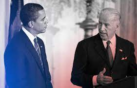

# Overview {.tabset .tabset-fade}


{width=70%}


This report analyzes the inaugural speeches of the last two sitting Democratic presidents. The goal is to elucidate changes that have occurred within the party and politics between 2008 and 2021. The president's speeches are compared through a series of analyses to better understand these changes. A word cloud is created to illustrate the top 15 most used words in each speech (generic words removed). Next, average sentiments in each speech are analyzed along an affinity scale. This scale visualizes overall the negative or positive manner of speech over a period of time. Speech pages were used as a proxy for time here. Last, these sentiments are mapped onto words denoting the messages within the speech. 

**Data Citation:** 
January 20, 2009: Inaugural Address | Miller Center. (2016, October 20). https://millercenter.org/the-presidency/presidential-speeches/january-20-2009-inaugural-address

January 20, 2021: Inaugural Address | Miller Center. (2021, January 21). https://millercenter.org/the-presidency/presidential-speeches/january-20-2021-inaugural-address


## Word Wrangling
```{r setup, include= TRUE, warning = FALSE, message = FALSE}
knitr::opts_chunk$set(echo = TRUE, message = FALSE, warning = FALSE )
library(tidyverse)
library(here)
library(tidytext)
library(textdata)
library(pdftools)
library(ggwordcloud)
library(patchwork)

#Read in PDF's
obama <- pdf_text(here("data", "ObamaInaugural2009.pdf")) #Obama's Acceptance Speech in 2008
biden <- pdf_text(here("data", "BidenInaugural2021.pdf")) #Biden's Acceptance Speech in 2021
```

```{r}
#Creating dataframes: adding page numbers to line numbers
obama_lines <- data.frame(obama) %>% 
  mutate(page = 1:n()) %>% #create a column names page that creates page numbers
  mutate(text_full = str_split(obama, pattern = '\\n')) %>% #splits pages into line by line, but keeps page number info. \\n looks for an actual \ and then a new line (\n)
  unnest(text_full) %>% #takes vector of string pieces we just made and creates a new line for each of those observations
  mutate(text_full = str_trim(text_full)) 

biden_lines <- data.frame(biden) %>% 
  mutate(page = 1:n()) %>% #create a column names page that creates page numbers
  mutate(text_full = str_split(biden, pattern = '\\n')) %>% #splits pages into line by line, but keeps page number info. \\n looks for an actual \ and then a new line (\n)
  unnest(text_full) %>% #takes vector of string pieces we just made and creates a new line for each of those observations
  mutate(text_full = str_trim(text_full)) 

#Breaking dataframe into smaller pieces so that each word has its own line
obama_words <- obama_lines %>% 
  unnest_tokens(word, text_full, token = 'words') %>% #tokenizes (counts) of something based what you give in the token argument. word here is a new column that is made. Data is pulled from obama
  select(-obama)

biden_words <- biden_lines %>% 
  unnest_tokens(word, text_full, token = 'words') %>% 
  select(-biden)

###Getting rid of America, American, Americans for better analysis
stop_america <- c("america", "american", "americans")
stop_america_df <- data.frame(stop_america, "word")
join_stop_america_df <- stop_america_df %>% 
  mutate(word = stop_america) %>% 
  select(-X.word.) %>% 
  select(-stop_america)

# Getting rid of stop words  
x <- stop_words #this removes those extra words we don't need (the, and, of, a)

obama_words_clean <- obama_words %>% 
  anti_join(stop_words, by = 'word') %>% 
  anti_join(join_stop_america_df, by = "word") %>% 
  mutate(page = as.character(page))

biden_words_clean <- biden_words %>% 
  anti_join(stop_words, by = 'word') %>% 
  anti_join(join_stop_america_df, by = "word") %>% 
  mutate(page = as.character(page))

#Looking at most common words
obama_wordcount <- obama_words_clean %>%
  count(word)
biden_wordcount <- biden_words_clean %>%
  count(word)

#Finding the most common 15 words

obama_top_15_words <- obama_wordcount %>% 
  arrange(-n) %>% #by descending order of wordcount
  slice(1:15) %>% #cuts at 1-15 value in counts
  ungroup()

biden_top_15_words <- biden_wordcount %>% 
  arrange(-n) %>% #by descending order of wordcount
  slice(1:15) %>% #cuts at 1-15 value in counts
  ungroup()
```

## Top 15 Word Cloud
```{r}
  
obama_cloud <- ggplot(data = obama_top_15_words, aes(label = word)) + #geom_text_word cloud needs this label aesthetic 
  geom_text_wordcloud(aes(color = n, size = n), shape = "diamond") + #words differentiated by color and those that show up more frequently will be bigger
  scale_size_area(max_size = 6) + #keeps scale of words within reason
  scale_color_gradientn(colors = c("lightblue","blue","darkblue")) + #like scale_color_manual
  theme_minimal() +
  labs(title = "Obama Acceptance Speech 2008")

biden_cloud <- ggplot(data = biden_top_15_words, aes(label = word)) + #geom_text_word cloud needs this label aesthetic 
  geom_text_wordcloud(aes(color = n, size = n), shape = "diamond") + #words differentiated by color and those that show up more frequently will be bigger
  scale_size_area(max_size = 6) + #keeps scale of words within reason
  scale_color_gradientn(colors = c("lightblue","blue","darkblue")) + #like scale_color_manual
  theme_minimal() +
  labs(title = "Biden Acceptance Speech 2021")

obama_cloud + biden_cloud
```

### Conclusions: 
There is a relatively consistent theme here. Both are focused on the people, the common good, and peace. It is notable however that Biden mentions war while Obama mentions peace. Women and children are a common thread, as well as justice and power. These two presidents are speaking a decade apart, but they maintain remarkably consistent messaging in their inaugural speeches. Let's delve farther in. 

## Affinity Scores
```{r}
### Creating afinn dfs
obama_afinn <- obama_words_clean %>% 
  inner_join(get_sentiments("afinn"), by = 'word')

biden_afinn <- biden_words_clean %>% 
  inner_join(get_sentiments("afinn"), by = 'word')

###Assembling afinn plot dfs
obama_afinn_counts <- obama_afinn %>% 
  count(page, value)  
  

obama_afinn_means <- obama_afinn %>% 
  group_by(page) %>% 
  summarize(mean_afinn = mean(value))

biden_afinn_counts <- biden_afinn %>% 
  count(page, value) 

biden_afinn_means <- biden_afinn %>% 
  group_by(page) %>% 
  summarize(mean_afinn = mean(value))

#Creating plots
obama_afinn_plot <- ggplot(data = obama_afinn_means, 
       aes(x = fct_rev(factor(page)),
           y = mean_afinn)) +
  labs(title = "Obama Affinity Score", x = "Speech Page", y = "Affinity Score") +
  geom_col(fill = "skyblue") +
  coord_flip() +
  theme_classic()

biden_afinn_plot <- ggplot(data = biden_afinn_means, 
       aes(x = fct_rev(factor(page)),
           y = mean_afinn)) +
    labs(title = "Biden Affinity Score", x = "Speech Page", y = "Affinity Score") +
  geom_col(fill = "royalblue") +
  coord_flip() +
  theme_classic()

obama_afinn_plot | biden_afinn_plot
```


### Conclusions: 
- Obama begins on a somber note, likely remarking about the past eight years that have been tough for the United States. He then bring it more positive before directly addressing a very negative tone. Notably, he ends this speech with incredibly strong positivity. 
- Biden however, begins incredibly positive and celebratory. He then delves in to negativity, likely addressing the pandemic and the financial hardship that Americans have been facing. However, he brings it back around and tapers off on a positive note. However, not nearly as strongly as Obama did. 
- These two speeches are almost a reverse mirror image of one another. Obama seems to maintain a more positive tone overall while Biden spends a long time in the negative. They both net positive, however Obama's dreams of hope outshine Biden's call for Unity in terms of overall positivity. 

## Sentimentality Scores
```{r}
obama_nrc <- obama_words_clean %>% 
  inner_join(get_sentiments("nrc"))

biden_nrc <- biden_words_clean %>% 
  inner_join(get_sentiments("nrc"))
```

```{r}
obama_nrc_counts <- obama_nrc %>% 
  count(page, sentiment)
biden_nrc_counts <- biden_nrc %>% 
  count(page, sentiment)

obama_nrc_plot <- ggplot(data = obama_nrc_counts, aes(x = sentiment, y = n)) +
  geom_col(fill = "skyblue") +
  #facet_wrap(~page) +
  coord_flip() +
  labs(title = "Obama Sentiment Score", x = "Score", y = "Sentiment") +
  theme_classic()

biden_nrc_plot <- ggplot(data = biden_nrc_counts, aes(x = sentiment, y = n)) +
  geom_col(fill = "royalblue") +
  #facet_wrap(~page) +
  coord_flip() +
  labs(title = "Biden Sentiment Score", x = "Score", y = "Sentiment") +
  theme_classic()

obama_nrc_plot | biden_nrc_plot
```

### Conclusions:
 
 Here is the most remarkable conclusion of all: 
 
 - More than a decade appart and these speeches maintain nearly identical sentiment scores.
 - This points toward common themes of inaugural speeches but also highlights the key beliefs of the Democratic party through time.
 - They net positive, maintain trust as a core value and while they highlight negativity and fear, that is nearly matched by joy and anticipation. 

